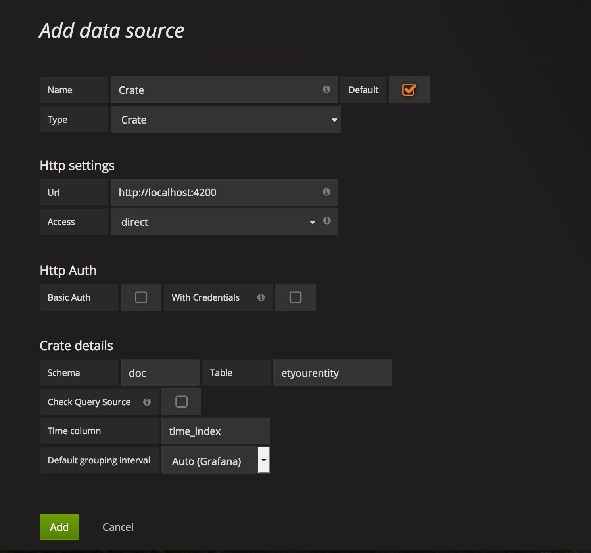
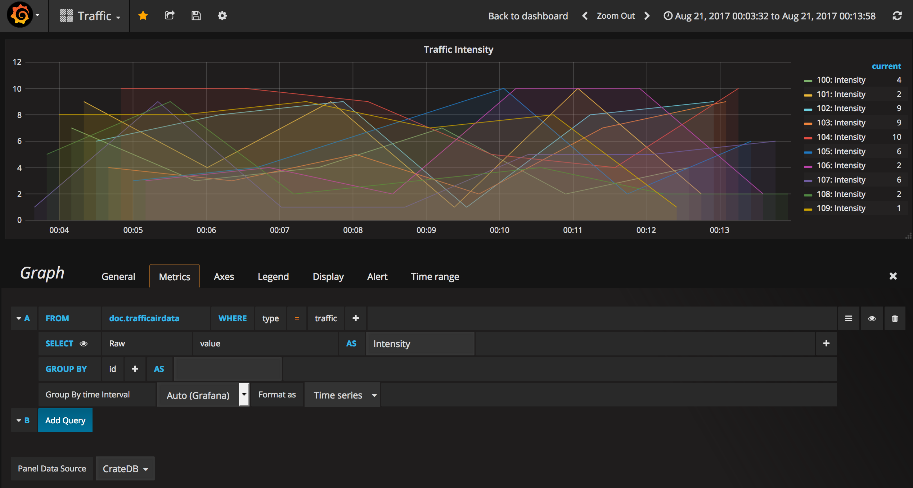

# Grafana

[**Grafana**](https://grafana.com/) is a powerful visualization tool that we can use to display graphics of the persisted data.

In order to read data from a [Crate](./crate.md) database, grafana leverages on the [Grafana Datasource Plugin for CrateDB](https://grafana.com/plugins/crate-datasource).

If you followed the [Installation Guide](./index.md), you have already Grafana running in a Docker container, with the aforementioned plugin already installed.

For now, crate data sources are restricted to a single table, and Quantum leap creates one table per entity type; hence, you'll have to create one data source per entity type. If this is a problem/limitation for you, open an issue in quantumleap's repo and we can see how to work around.

## Configuring the DataSource

Explore your deployed grafana instance (e.g http://localhost:3000). If you didn't change the defaults, *admin/admin* are the default credentials.

Go to *Add data source* and fill in the required fields, with the following observations:

- **Name**: This is the name you want for the Datasource. We recommend naming it after the entity type.
- **Type**: Use *Crate*. If you don't see *Crate*, check your installation of the datasource plugin.
- **Url**: The full url where cratedb was deployed.
- **Schema**: The default is doc.
- **Table**: The name of the table of the entity. See the [Data Retrieval](../user/index.md) section to know how table names are defined.
- **Time column**: The name of the column used as time index. By default is 'time_index', as explained in the [The Time Index](../user/index.md) section.

Image below as an example

## Using the DataSource in your Graph

Having your datasource setup, you can start using it in the different visualization widgets.

The following is an example of a Graph using a Crate datasource. Note the selection of the datasource (called CrateDB in this case), as well as the specification of the table in the *from* field. Note that the table is referenced as *schema.tablename* (e.g: *doc.etairqualityobserved*)

