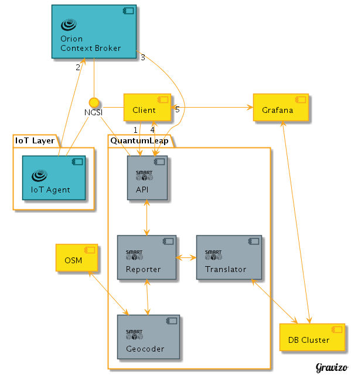

# QuantumLeap

## Overview

QuantumLeap is the first implementation of an API that supports the storage of
NGSI [FIWARE NGSIv2](http://docs.orioncontextbroker.apiary.io/#) data into a
[time-series database](https://en.wikipedia.org/wiki/Time_series_database).

In the end, it has similar goals to those of [FIWARE's Comet STH](https://fiware-sth-comet.readthedocs.io/en/latest/).
However, Comet does not yet support NGSIv2, it's strongly tied to MongoDB, and
some of the conditions and constraints under which it was developed are no
longer hold. That being said, there is nothing wrong with it; this is just an
exploration on a new way to provide historical data for FIWARE NGSIv2 with
different time-series databases as backend.

The idea is to keep the time-series database swappable so as to look forward to
having support for different ones. We started testing
[InfluxDB](https://docs.influxdata.com/influxdb/), [RethinkDB](https://www.rethinkdb.com/docs/)
and [Crate](http://www.crate.io). However, we have decided for now to focus the
development on the translator for [Crate](http://www.crate.io) because of the
following advantages:

- Easy scalability with [containerised database cluster](https://crate.io/docs/crate/guide/en/latest/deployment/containers/index.html)
out of the box.
- [Geo-queries](https://crate.io/docs/crate/reference/en/latest/general/dql/geo.html)
support out of the box
- Nice [SQL-like querying language](https://crate.io/docs/crate/reference/en/latest/sql/index.html)
to work with
- [Supported integration](https://grafana.com/plugins/crate-datasource/installation)
with visualisation tools like [Grafana](http://www.grafana.com)

## Typical Usage and How it works

The typical usage scenario for QuantumLeap would be the following (notice the
numbering of the events)...

The idea of **QuantumLeap** is pretty straightforward. By leveraging on the [NGSIv2 notifications mechanism](http://fiware-orion.readthedocs.io/en/latest/user/walkthrough_apiv2/index.html#subscriptions),
clients first create an Orion subscription **(1)** to notify QuantumLeap of the
changes in the entities they care about. This can be done either through
*QuantumLeap*'s API or directly talking to *Orion*. Details of this process are
explained in the [Orion Subscription part of the User Manual](user/index.md#orion-subscription).

Then, new values arrive in [Orion Context Broker](https://fiware-orion.readthedocs.io)
**(2)** for the entities of interest, for example from a whole **IoT layer**
governed by 1 or more [IoT Agents](https://catalogue.fiware.org/enablers/backend-device-management-idas)
pushing data in NGSI format. Consequently, notifications will arrive to
QuantumLeap's API `/v2/notify` endpoint **(3)**.

QuantumLeap's **Reporter** submodule will parse and validate the received
notification and eventually feed it to the configured **Translator**. The
Translator is ultimately responsible for persisting the NGSI information to the
configured times-series database cluster.

The current API includes some endpoints for raw and aggregated data retrieval
**(4)** for clients to query historical data. It also supports deletion of
historical records. Please note not all endpoints are currently implemented in
QL. For more info about the API, you can refer to the
[NGSI-TSDB specification](https://app.swaggerhub.com/apis/smartsdk/ngsi-tsdb/0.1).

For the visualisation of data **(5)**, at the time being we are using
[Grafana](http://grafana.com/), complemented with open source plugins for the
databases. In the future, we could envision a grafana plugin for direct
interaction with QL's API.

## More information

- Refer to the [Admin Guide](admin/index.md) to learn more about installing
QuantumLeap and getting it running.
- Refer to the [User Manual](user/index.md) to learn more about how to use it
and connect it to other complementary services.
- Have a look at the [SmartSDK guided tour](http://guided-tour-smartsdk.readthedocs.io/en/latest/)
for more examples of QuantumLeap usage.
