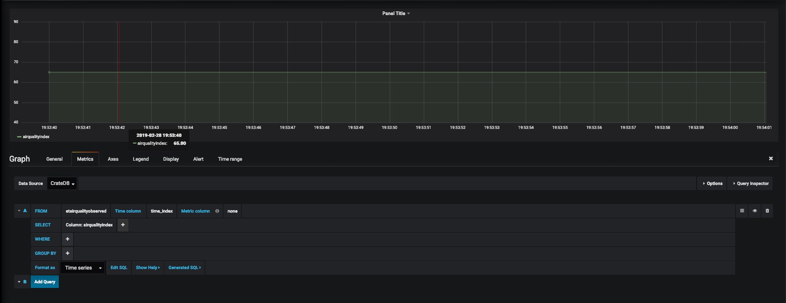

# Grafana

[**Grafana**](https://grafana.com/) は、永続化されたデータのグラフィックを
表示するために使用できる強力な視覚化ツールです。

Grafana を QuantumLeap [CrateDB](./crate.md) または [Timescale](./timescale.md)
バックエンドに簡単に接続して、ダッシュボードで QuantumLeap データを視覚化できま
す。どちらの場合も、使用する Grafana データソースは、通常は最新バージョンの
Grafana に同梱されている
[Postgres のデータソース](http://docs.grafana.org/features/datasources/postgres/)
です。

[インストール・ガイド](./installing.md) に従っているのであれば、Docker コンテナ内で
既に Grafana が実行されています。ローカルに展開されている場合は、おそらく
[http://0.0.0.0:3000](http://0.0.0.0:3000) です。

CrateDB バックエンドを使用している場合は、
[このブログ投稿](https://crate.io/a/pair-cratedb-with-grafana-an-open-platform-for-time-series-data-visualization/)
を読み、以下のセクションで説明する Grafana データソースの設定方法に関する
Crate の推奨事項に従うことをお勧めします。

## CrateDB のデータソースの設定

デプロイした Grafana インスタンスを調べます
(例 : [http://0.0.0.0:3000](http://0.0.0.0:3000))。
デフォルトの認証情報を変更しなかった場合は、ユーザとパスワードの両方に
`admin` を使用してください。

次の点を考慮して、*データソースの追加*に行き、`PostreSQL` を選択して、
必須フィールドに入力します。

- **Name** : これはデータソースに付ける名前です。`CrateDB` と名付けて
  デフォルトにします
- **Host** : CrateDB がデプロイされた場所の完全な URL、ただし、ポートは
  `5432` です。docker-compose の例では、これは `crate:5432` になります
- **Database** : これはデータベース・スキーマの名前です。デフォルトでは、
  CrateDB で `doc` を使用しますが、マルチ・テナンシーのヘッダーを使用している
  場合は、エンティティ型のテナントによってスキーマが定義されます。詳細は、
  [マルチ・テナンシーのセクション](../user/using.md#multi-tenancy)
  を確認してください。
- **User** : `crate` ユーザを使います
- **SSL モード** : `無効にします`

次の図は、データソース設定がどのようになっているかの例を示しています。

*Save & Test* をクリックすると、OK メッセージが表示されます。

## PostgreSQL のデータソースの設定

このプロセスは上で概説したものとほとんど同じであり、Grafana
[PosgreSQL　のデータソース・マニュアル](https://grafana.com/docs/features/datasources/postgres/)
に詳しく記載されています。 *TimescaleDB* データソースオプションを有効に
する必要があることに注意してください。

## グラフ内のデータソースの使用

データソースをセットアップしたら、
さまざまな視覚化ウィジェットで使用することができます。

以下は、CrateDB に接続されたデータソースを使用した単純なグラフの例です。
データソース (この場合は CrateDB と呼ばれます) の選択、および *from*
フィールドのテーブルの指定に注意してください。

テーブル名の前には `et` が付くことに注意してください。テーブル名がどのように
定義されているかについては、[Data Retrieval](../user/using.md#data-retrieval)
のセクションを参照してくださいが、エンティティ型を認識する必要があります。

[Time Index](../user/using.md##data-retrieval) のセクションで説明されている
ように、タイム・インデックスとして使われるカラムの名前は `time_index` です。

