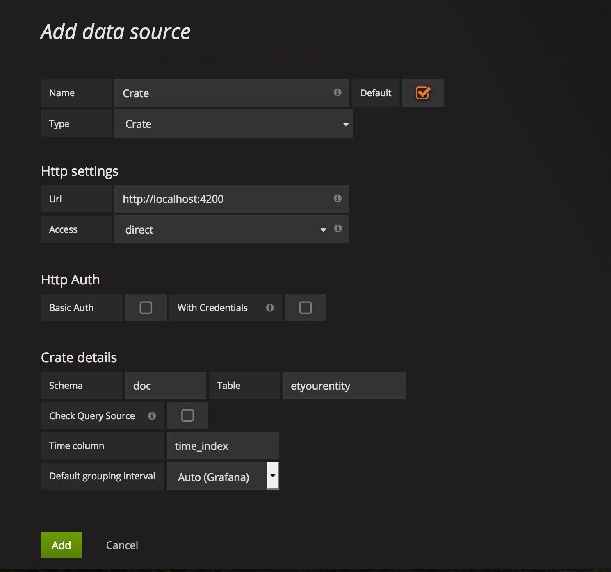

# Grafana

[**Grafana**](https://grafana.com/) is a powerful visualisation tool that we
can use to display graphics of the persisted data.

In order to read data from a [CrateDB](./crate.md) database, grafana leverages on
the [Grafana Datasource Plugin for CrateDB](https://grafana.com/plugins/crate-datasource).

If you followed the [Installation Guide](./index.md), you have already Grafana
running in a Docker container, with the crate-datasource plugin already
installed.

For now, crate data sources are restricted to a single table, and Quantum leap
creates one table per entity type; hence, you'll have to create one data source
per entity type. If this is a problem/limitation for you, [open an issue in
quantumleap's repo](https://github.com/smartsdk/ngsi-timeseries-api/issues)
and we can see how to work this out.

## Configuring the DataSource

Explore your deployed grafana instance (e.g http://localhost:3000). If you
didn't change the defaults credentials, use `admin` as both user and password.

Go to *Add data source* and fill in the required fields, with the following
observations:

- **Name**: This is the name you want for the Datasource. We recommend naming
it after the entity type (i.e, the table you will connect to).
- **Type**: Use `Crate`. If you don't see `Crate` as an option, refer to the
[Troubleshooting section](../user/troubleshooting.md).
- **Url**: The full url where cratedb was deployed.
- **Access**: Use `direct` if you're deploying everything locally. If you are
deploying crate behind a proxy (as in the case of [HA deployment](./index.md)),
choose the `proxy` option instead.
- **Schema**: The schema where the table is defined. By default, crate uses
`doc` schema, but if you are using multi-tenancy headers, the schema will be
defined by the tenant of the entity type. More info in the
[Multi-tenancy section](../user/index.md#multi-tenancy).
- **Table**: The name of the table of the entity. See the [Data Retrieval](../user/index.md#data-retrieval) section to know how table names are
defined.
- **Time column**: The name of the column used as time index. By default, it is `time_index`, as explained in the [Time Index](../user/index.md##data-retrieval)
 section.

The following image shows an example of the datasource configuration for an
entity type called *yourentity*

## Using the DataSource in your Graph

Having your datasource setup, you can start using it in the different
visualisation widgets.

The following is an example of a Graph using a CrateDB datasource. Note the
selection of the datasource (called CrateDB in this case), as well as the
specification of the table in the *from* field. Note that the table is
referenced as *schema.tablename* (e.g: *doc.etairqualityobserved*)

