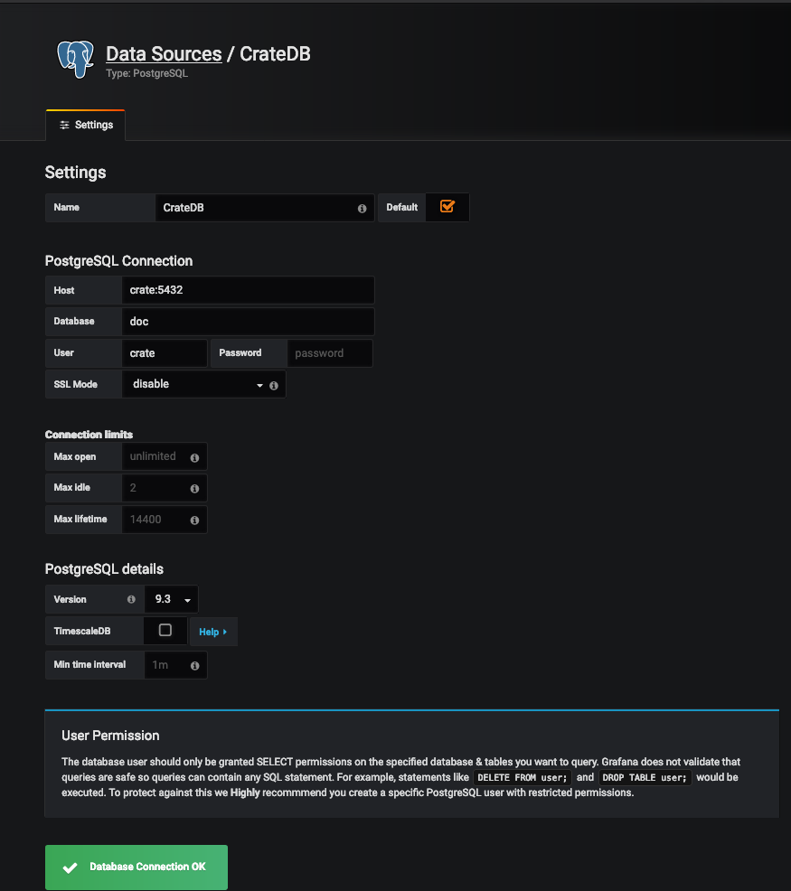

# Grafana

[**Grafana**](https://grafana.com/) is a powerful visualisation tool that we
can use to display graphics of the persisted data.

You can easily connect Grafana to either the QuantumLeap [CrateDB](./crate.md)
or [Timescale](./timescale.md) back end to visualise QuantumLeap data on
your dashboards. In both cases, the Grafana data source to use is the
[Postgres Datasource](http://docs.grafana.org/features/datasources/postgres/)
which normally ships with recent versions of Grafana.

If you followed the [Installation Guide](./installing.md), you have already Grafana
running in a Docker container. If deployed locally, it's probably at [http://0.0.0.0:3000](http://0.0.0.0:3000)

If you're using the CrateDB back end, we suggest you read
[this blog post](https://crate.io/a/pair-cratedb-with-grafana-an-open-platform-for-time-series-data-visualization/)
and follow Crate's recommendations on how to configure the Grafana
datasource which we have summarised in the below section.

## Configuring the DataSource for CrateDB

Explore your deployed Grafana instance (e.g [http://0.0.0.0:3000](http://0.0.0.0:3000)).
If you didn't change the defaults credentials, use `admin` as both user and
password.

Go to *Add data source*, select `PostreSQL` and fill in the required fields,
with the following considerations:

- **Name**: This is the name you want for the Datasource. Name it `CrateDB` and
make it default.
- **Host**: The full url where CrateDB was deployed, but on port `5432`. In the
docker-compose example, this should be `crate:5432`.
- **Database**: This is the name of the database schema. By default, crate uses
`doc` schema, but if you are using multi-tenancy headers, the schema will be
defined by the tenant of the entity type. More info in the
[Multi-tenancy section](../user/using.md#multi-tenancy).
- **User**: Use `crate` user.
- **SSL Mode**: `disable`.

The following image shows an example of how the datasource configuration should
look like

Click *Save & Test* and you should get an OK message.

## Configuring the DataSource for PostgreSQL

The process is pretty much the same as outlined above and is well documented
in the Grafana [PosgreSQL data source manual](https://grafana.com/docs/features/datasources/postgres/).
Note that you should enable the *TimescaleDB* data source option.

## Using the DataSource in your Graph

Having your datasource setup, you can start using it in the different
visualisation widgets.

The following is an example of a simple Graph using a datasource connected to
CrateDB. Note the selection of the datasource (called CrateDB in this case), as
well as the specification of the table in the *from* field.

Note table names are prefixed by `et`. See the [Data Retrieval](../user/using.md#data-retrieval)
section to know how table names are defined, but you should recognise the
entity type.

Note the name of the column used as time index is `time_index`, as explained
in the [Time Index](../user/using.md##data-retrieval) section.

