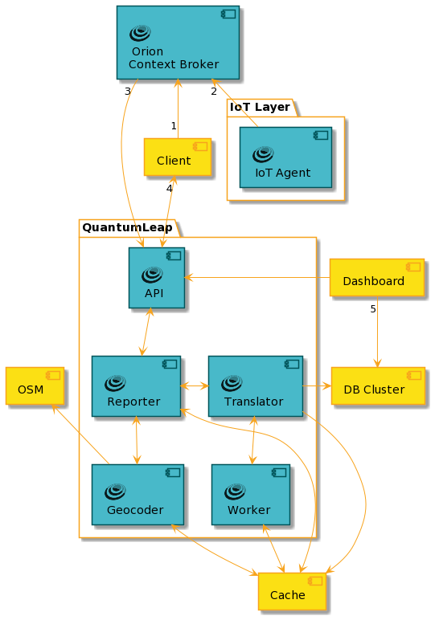

# QuantumLeap

[![FIWARE Core Context Management](https://img.shields.io/badge/FIWARE-Core-233c68.svg?logo=data:image/png;base64,iVBORw0KGgoAAAANSUhEUgAAABsAAAAVCAYAAAC33pUlAAAABHNCSVQICAgIfAhkiAAAA8NJREFUSEuVlUtIFlEUx+eO+j3Uz8wSLLJ3pBiBUljRu1WLCAKXbXpQEUFERSQF0aKVFAUVrSJalNXGgmphFEhQiZEIPQwKLbEUK7VvZrRvbr8zzjfNl4/swplz7rn/8z/33HtmRhn/MWzbXmloHVeG0a+VSmAXorXS+oehVD9+0zDN9mgk8n0sWtYnHo5tT9daH4BsM+THQC8naK02jCZ83/HlKaVSzBey1sm8BP9nnUpdjOfl/Qyzj5ust6cnO5FItJLoJqB6yJ4QuNcjVOohegpihshS4F6S7DTVVlNtFFxzNBa7kcaEwUGcbVnH8xOJD67WG9n1NILuKtOsQG9FngOc+lciic1iQ8uQGhJ1kVAKKXUs60RoQ5km93IfaREvuoFj7PZsy9rGXE9G/NhBsDOJ63Acp1J82eFU7OIVO1OxWGwpSU5hb0GqfMydMHYSdiMVnncNY5Vy3VbwRUEydvEaRxmAOSSqJMlJISTxS9YWTYLcg3B253xsPkc5lXk3XLlwrPLuDPKDqDIutzYaj3eweMkPeCCahO3+fEIF8SfLtg/5oI3Mh0ylKM4YRBaYzuBgPuRnBYD3mmhA1X5Aka8NKl4nNz7BaKTzSgsLCzWbvyo4eK9r15WwLKRAmmCXXDoA1kaG2F4jWFbgkxUnlcrB/xj5iHxFPiBN4JekY4nZ6ccOiQ87hgwhe+TOdogT1nfpgEDTvYAucIwHxBfNyhpGrR+F8x00WD33VCNTOr/Wd+9C51Ben7S0ZJUq3qZJ2OkZz+cL87ZfWuePlwRcHZjeUMxFwTrJZAJfSvyWZc1VgORTY8rBcubetdiOk+CO+jPOcCRTF+oZ0okUIyuQeSNL/lPrulg8flhmJHmE2gBpE9xrJNkwpN4rQIIyujGoELCQz8ggG38iGzjKkXufJ2Klun1iu65bnJub2yut3xbEK3UvsDEInCmvA6YjMeE1bCn8F9JBe1eAnS2JksmkIlEDfi8R46kkEkMWdqOv+AvS9rcp2bvk8OAESvgox7h4aWNMLd32jSMLvuwDAwORSE7Oe3ZRKrFwvYGrPOBJ2nZ20Op/mqKNzgraOTPt6Bnx5citUINIczX/jUw3xGL2+ia8KAvsvp0ePoL5hXkXO5YvQYSFAiqcJX8E/gyX8QUvv8eh9XUq3h7mE9tLJoNKqnhHXmCO+dtJ4ybSkH1jc9XRaHTMz1tATBe2UEkeAdKu/zWIkUbZxD+veLxEQhhUFmbnvOezsJrk+zmqMo6vIL2OXzPvQ8v7dgtpoQnkF/LP8Ruu9zXdJHg4igAAAABJRU5ErkJgggA=)](https://www.fiware.org/developers/catalogue/)

## Overview

QuantumLeap is a REST service for storing, querying and retrieving
[NGSI v2][ngsi-spec] and [NGSI-LD][ngsi-ld-spec]
(*experimental support*) spatial-temporal data. QuantumLeap converts
NGSI semi-structured data into tabular format and stores it in a
[time-series database][tsdb], associating each database record with
a time index and, if present in the NGSI data, a location on Earth.
REST clients can then retrieve NGSI entities by filtering entity sets
through time ranges and spatial operators. Note that, from the client's
stand point, these queries are defined on NGSI entities as opposed
to database tables. However, the query functionality available through
the REST interface is quite basic and most complex queries typically
require clients to use the database directly.

The REST [API specification][ql-spec], dubbed NGSI-TSDB, which
QuantumLeap implements has been defined with the goal of providing
a database-agnostic REST interface for the storage, querying and
retrieval of NGSI entity time series that could be as close as possible
to the NGSI specification itself. Thus NGSI-TSDB provides a uniform
and familiar (to FIWARE developers) mechanism to access time
series data which allows implementing services such as QuantumLeap
to transparently support multiple database back ends. In fact,
presently QuantumLeap supports both [CrateDB][crate] and
[Timescale][timescale] as back end databases.

### NGSI-LD support

PR [#373](https://github.com/orchestracities/ngsi-timeseries-api/pulls/373)
introduced basic support for basic [NGSI-LD][ngsi-ld-spec] relying on v2 API.
In short this means that using the current endpoint QuantumLeap can
store NGSI-LD payloads with few caveats (see
[#398](https://github.com/orchestracities/ngsi-timeseries-api/issues/398)):

- temporal attributes are not currently supported
  ([#395](https://github.com/orchestracities/ngsi-timeseries-api/issues/395));
  what is relevant here is that this attributes are
  used to create the time index of the series

- other attributes may be added as well in future (not a priority probably,
  so may not be tackled any time
  [#396](https://github.com/orchestracities/ngsi-timeseries-api/issues/396))

- context is currently not stored.

- query endpoints returns NGSIv2 data types.

NGSI-LD temporal queries seem to have a semantic that implies that
only numeric values are tracked in time series. This was never the case
for QuantumLeap that trace over time any attribute (also not numeric ones),
since they may change as well.

NGSI-LD semantics also seem to track values over time
of single attributes. QuantumLeap to enable to retrieve full entity values in a given
point in time stores the whole entity in a single table (this avoids the need
for JOINs that are notoriously time consuming - but on the other hand generates
more sparse data). In doing so, we create for the entity a single time index,
this is due to the fact that while different dateTime attributes can be defined
and hence queried, only one can be used to index time series in
all modern timeseries DB (to achieve performance).
This imply that we have a policy to compute such time index (either custom
and referring to an attribute of the entity, or using the "latest" time
metadata linked to the entity or to an attribute).
The issue is that if the notification payload sent to QuantumLeap includes all
attributes, also not update ones, QuantumLeap will "timestamp" all values
(also old ones) with that timestamp.

This means that the ability to track a specific value
of an attribute in a point in time depends on the actual notification.

In short, given that we aim to ensure both forward compatibility
(data store as NGSIv2 can be queried in future as NGSI-LD)
and backward compatibility (data store as NGSI-LD can be queried as NGSIv2),
implementing NGSI-LD temporal api, may not be 100% compliant with
the specs.

### Relation to STH Comet

Although QuantumLeap and FIWARE [STH Comet][comet] share similar
goals, Comet doesn't support multiple database back ends (only
MongoDB is available) and doesn't support NGSI v2 either. While
Comet per se is a fine piece of software, some of the needs and
assumptions that prompted its developments are no longer current.
QuantumLeap started out as an exploration of an alternative way
to make historical data available to the FIWARE ecosystem without
committing to a specific database back end.

## Architecture

Typically QuantumLeap acquires IoT data, in the form of NGSI entities,
from a FIWARE IoT Agent layer indirectly through NGSI notifications
set up upfront with the context broker, [Orion][orion]. (We assume
the reader is familiar with the NGSI publish-subscribe mechanism
described in the *Notification Messages* and *Subscriptions* sections
of the [NGSI specification][ngsi-spec].) As mentioned earlier, incoming
NGSI entities are converted to database records and stored in one
of the configured time series database back ends---typically, a
database cluster. Often visualisation tools such as [Grafana][grafana]
are deployed too in order to visualise the time series data
that QuantumLeap stores in the database. The below diagram illustrates
relationships and interactions among these systems in a typical
QuantumLeap deployment scenario.

In order for QuantumLeap to receive data from Orion, a client creates
a subscription in Orion specifying which entities should be notified
when a change happens **(1)**. (You can read more about setting up
subscriptions in the [Orion Subscription][ql-man.sub] section of the
QuantumLeap manual.)

From this point on, when [Agents in the IoT layer][fw-catalogue] push
data to the context broker **(2)**, if the data pertains to entities
pinpointed by the client subscription, Orion forwards the data to
QuantumLeap by POSTing NGSI entities to QuantumLeap's
[notify end point][ql-spec] **(3)**.

QuantumLeap's **Reporter** component parses and validates POSTed data.
Additionally, if geo-coding is configured, the **Reporter** invokes
the **Geocoder** component to harmonise the location representation
of the notified entities, which involves looking up geographic information
in [OpenStreetMap][osm] (OSM).
At this stage, depending on the deployed mode you selected, data are immediately
processed or stored in the cache for later processing.
In the first case, the **Reporter** passes on
the validated and harmonised NGSI entities to a **Translator** component.
In the second case, the **Reporter** stores on
the validated and harmonised NGSI entities to the **Cache** component,
that is acting as a message queue. The **Worker** component will read pending
messages to be processed and will pass them to a **Translator** component.
The [Admin Guide][ql-man.admin] contains more details about the
[work queue][ql-man.wq].

**Translator** convert NGSI entities to tabular format and persist
them as time series records in the database. There is a **Translator**
component in correspondence of each supported database back end - see
section below. Depending on the [configuration][ql-man.db-sel],
a specific **Translator** is used.

When a client queries the REST API to retrieve NGSI entities **(4)**,
the **Reporter** and **Translator** interact to turn the Web query
into a SQL query with spatial and temporal clauses, retrieve the
database records and convert them back to the NSGI entity time series
eventually returned to the client. As noted earlier, the query
functionality available through the REST interface is quite basic:
QuantumLeap supports filtering by time range, geographical queries
as defined by the [NGSI specification][ngsi-spec] and simple
aggregate functions such as averages. Other than that, QuantumLeap
also supports deleting historical records but note that presently
it does **not** implement in full the NGSI-TSDB specification - please
refer to the REST API [specification][ql-spec] for the details.

Finally, the diagram shows a Dashboard querying the database directly
in order to visualise time series for a Web client **(5)**.
In principle, it should be possible to develop a Dashboard can also
query the QuantumLeap REST API instead of the database which
would shield visualisation tools from QuantumLeap internals.

## Database Back Ends

One guiding principle in QuantumLeap design has been the ability
to use multiple time series databases. This design choice is justified
by the fact that a database product may be more suitable than
another depending on circumstances at hand. Currently QuantumLeap
can be used with both [CrateDB][crate] and [Timescale][timescale].

The [Database Selection][ql-man.db-sel] section of this manual
explains how to configure QuantumLeap to use one of the available
database back ends.

### CrateDB back end

[CrateDB][crate] is the default back end. It is easy to scale thanks
to its shared-nothing architecture which lends itself well to
[containerisation][crate-doc.cont] so it is relatively easy to
manage a containerised CrateDB database cluster, e.g. using Kubernetes.
Moreover, CrateDB uses [SQL][crate-doc.sql] to query data, with
built-in extensions for temporal and [geographical queries][crate-doc.geo].
CrateDB offers as well a Postgres API, making simpler its integration.
For example, you can leverage Grafana [PostgreSQL plugin][grafana.pg]
to visualise time series stored in CrateDB.

QuantumLeap stores NGSI entities in CrateDB using the `notify` endpoint.

    -------------------------          ---------------
    |        CrateDB        |  <-----  | QuantumLeap |-----O notify
    -------------------------          ---------------

### Timescale back end

[Timescale][timescale] is another time series databases that can be
used with QuantumLeap as a back end to store NGSI entity time series.
Indeed, QuantumLeap provides full support for storing NGSI entities in
Timescale, including geographical features (encoded as GeoJSON or NGSI
Simple Location Format), structured types and arrays.

QuantumLeap stores NGSI entities in Timescale using the
`notify` endpoint (as for CrateDB).
The Timescale back end is made up of [PostgreSQL][postgres]
with both Timescale and [PostGIS][postgis] extensions enabled:

    -------------------------
    | Timescale     PostGIS |          ---------------
    | --------------------- |  <-----  | QuantumLeap |-----O notify
    |       Postgres        |          ---------------
    -------------------------

PostgreSQL is a rock-solid, battle-tested, open source database,
and its PostGIS extension provides excellent support for advanced
spatial functionality while the Timescale extension has fairly
robust support for time series data. The mechanics of converting
an NGSI entity to tabular format stay pretty much the same as in
the Crate back end except for a few improvements:

- NGSI arrays are stored as (indexable & queryable) JSON as opposed
  to the flat array of strings in the Crate back end.
  
- GeoJSON and NGSI Simple Location Format attributes are stored as
  spatial data that can be indexed and queried - full support for
  spatial attributes is still patchy in the Crate back end.

The `test_timescale_insert.py` file in the QuantumLeap source base
contains quite a number of examples of how NGSI data are stored in
Timescale.

#### Note: querying & retrieving database

At the moment, QuantumLeap implement experimental querying
of data through the QuantumLeap REST API.
This means that while REST API on top of CrateDB
have been tested in production, this is not the case for
Timescale.

## Cache Back End

To reduce queries to databases or to geocoding APIs, QuantumLeap
leverages a cache. The only cache backend supported so far
is Redis.
Caching support for queries to databases is *experimental*.

    --------------------          ---------------
    |        DB        |  ------  | QuantumLeap |-----O notify
    --------------------          ---------------
                                         |
                                         |                                         
                                  ---------------
                                  |    Redis    |
                                  ---------------                                        

The cache backend is also used in case of queue workflow centric deployment,
to store pending tasks to be processed.

### Query cache

As of today, the query caching stores:

- Version of CrateDB. Different version of CrateDB supports different SQL
  dialects, so at each request we check which version of CrateDB
  we are using. By caching this information, each thread will ask
  this information only once. Of course this could be passed as variable,
  but then live updates would require QuantumLeap down time. Currently, you can
  update from a Crate version to another with almost zero down time (except
  the one caused by Crate not being in ready state), you would need
  only to clear the key `crate` from redis cache. TTL in this case is
  1 hour, i.e. after one hour version will be checked again against CrateDB.
  
- Metadata table. The metadata table is used to store information about the
  mapping between original NGSI attributes (including type) to db column names.
  Basically this information is required to perform "consistent" data injection
  and to correctly NGSI type retrieved attributes by queries. Given concurrency
  due to the support of multithread and ha deployment, cache in this case has by
  default a shorter TTL (60 sec). Cache is anyhow re-set every time a change to
  Metadata table occurs (e.g. in case the incoming payload include a new
  entityType or a new attribute for an existing entityType). **Metadata**
  for a specific entityType are removed only if a entityType is dropped, not
  in case all its values are removed.

Query caching can be configured with the following variables:

- `CACHE_QUERIES`: `True` or `False` enable or disable caching for queries
- `DEFAULT_CACHE_TTL`: Time to live of metadata cache, default: `60` (seconds)

### Geocoding cache

This feature allows to support QuantumLeap in the geocoding of NGSI
entities that have a location expressed as an address and not as GeoJSON.
The geocoding feature adds a GeoJSON location to the entity leveraging
the address contained in the entity: from the country, city, street
name and postal number, a request to the geocoding service is generated.
The response, depending of the available information and the geocoder capacity
may be a point, a line or a polygon.

QuantumLeap uses Open Street Maps (OSM) to geocode the entity's address.
This is usually a rather expensive call, thus a Redis
cache is used to avoid looking up the same address over and over again over a
short period of time --- e.g. think a batch entity update containing several
entities sharing the same address. To enable caching of geo-location data,
you need to use the following environment variable:

- `CACHE_GEOCODING`: `True` or `False`

Also the environment variables `REDIS_HOST` and `REDIS_PORT`
respectively set to the location of REDIS instance and its access port.

### Work Queue cache

QuantumLeap may be configured to use a work queue for NGSI notifications.
In this case, when an entity payload comes through the notify endpoint,
the API queues the payload as a task in the cache and returns a `200`
to the client immediately. A separate instance of QuantumLeap, configured as
a queue worker, fetches the task from the queue and runs it to actually insert
the NGSI entities into the DB, possibly retrying the insert at a later time
if it fails.

When using a work queue, you will have two type of QuantumLeap processes:
a type to expose the API and store payloads in the queue;
and a type to execute the queue worker that asynchronously fetches tasks from
the queue.
The work queue set-up is enabled and configured through the `WQ_*` environment
variables:

- `WQ_OFFLOAD_WORK` - Whether to offload insert tasks to a work queue
default: `False`
- `WQ_RECOVER_FROM_ENQUEUEING_FAILURE` - Whether to run tasks immediately
if a work queue is not available. Default: `False`
- `WQ_MAX_RETRIES` - How many times work queue processors should retry failed
tasks. Default: `0` (no retries).
- `WQ_FAILURE_TTL` - How long, in seconds, before removing failed tasks from
the work queue. Default: `604800` (a week).
- `WQ_SUCCESS_TTL` - How long, in seconds, before removing successfully run
tasks from the work queue. Default: `86400` (a day)
- `WQ_WORKERS` - How many worker queue processors to spawn

Further info about these variables is available
[here](./admin/configuration.md).

## Further Readings

- The [Admin Guide][ql-man.admin] explains how to install and run
  QuantumLeap.
- The [User Manual][ql-man.user] delves into how to use it and connect
  it to other complementary services.
- [FIWARE Time Series][ql-tut]: a complete, step-by-step, hands-on tutorial
  to learn how to set up and use QuantumLeap.

[comet]: https://fiware-sth-comet.readthedocs.io/en/latest/
    "FIWARE STH Comet Manual"
[crate]: http://www.crate.io
    "CrateDB Home"
[crate-doc.cont]: https://crate.io/docs/crate/guide/en/latest/deployment/containers/
    "CrateDB Containers"
[crate-doc.geo]: https://crate.io/docs/crate/reference/en/latest/general/dql/geo.html
    "CrateDB Geo-search"
[crate-doc.sql]: https://crate.io/docs/crate/reference/en/latest/sql/index.html
    "CrateDB SQL"
[fw-catalogue]: https://www.fiware.org/developers/catalogue/
    "FIWARE Catalogue"
[grafana]: http://www.grafana.com
    "Grafana Home"
[grafana.pg]: http://docs.grafana.org/features/datasources/postgres/
    "Grafana PostgreSQL Data Source"
[ngsi-spec]: https://fiware.github.io/specifications/ngsiv2/stable/
    "FIWARE-NGSI v2 Specification"
[ngsi-ld-spec]: https://www.etsi.org/deliver/etsi_gs/CIM/001_099/009/01.01.01_60/gs_CIM009v010101p.pdf
    "ETSI NGSI-LD API Specification"
[orion]: https://fiware-orion.readthedocs.io
    "Orion Context Broker Home"
[osm]: https://www.openstreetmap.org
    "OpenStreeMap Home"
[postgres]: https://www.postgresql.org
    "PostgreSQL Home"
[postgis]: https://postgis.net/
    "PostGIS Home"
[ql-man.admin]: ./admin/installing.md
    "QuantumLeap - Admin Guide"
[ql-man.db-sel]: ./admin/configuration.md
    "QuantumLeap - Configuration"
[ql-man.sub]: ./user/using.md#orion-subscription
    "QuantumLeap - Orion Subscription"
[ql-man.user]: ./user/using.md
    "QuantumLeap - User Manual"
[ql-man.wq]: ./admin/wq.md
    "QuantumLeap - Work Queue"
[ql-spec]: https://app.swaggerhub.com/apis/smartsdk/ngsi-tsdb
    "NGSI-TSDB Specification"
[ql-tut]: https://fiware-tutorials.readthedocs.io/en/latest/time-series-data/
    "FIWARE Tutorials - Time Series Data"
[timescale]: https://www.timescale.com
    "Timescale Home"
[tsdb]: https://en.wikipedia.org/wiki/Time_series_database
    "Wikipedia - Time series database"
